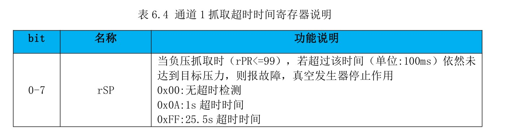
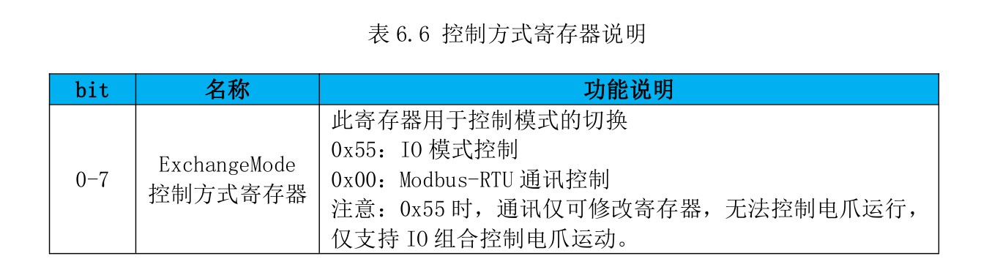

+ EVS01电动吸盘相关的理论基础知识

## 操作模式

+ EVSO1电动吸盘，主要具有两种工作模式：
  + 高级模式
  + 自动模式

## 串口设置

+ 物理接口：
  + RS-485

+ 波特率：
  + 115200 bps (默认)

+ 数据位
  + 8 bit

+ 停止位
  + 1

+ 奇偶校验
  + 无

+ 数据流控制
  + 无

+ 控制寄存器首地址
  + 0x03E8 (1000)

+ 状态寄存器首地址
  + 0x07D0 (2000)

## 命令帧格式

+ 标准Modbus-RTU协议，报文格式如下：
  + `| 设备地址(1 byte) | 功能代码(1 byte) | 数据格式(N * 1 byte) | CRC校验码(2 bytes) |`

+ 设备地址：
  + EVS01电动吸盘在Modbus-RTU通讯网络中的从站地址，其范围为：1-247，参数可修改

+ 功能代码：
  + EVS01电动吸盘支持0x03, 0x04, 0x10等功能码

+ 数据格式：
  + 包括读写数据的寄存器地址，数据长度，数据等

+ CRC校验码： 
  + 数据帧CRC校验码

## Modbus 功能码

+ 功能代码 03(FC03)用于读取保持寄存器(6.2 节中的控制用寄存器与 6.4 节中的设备寄存器)的状态。
  + 控制用寄存器 0x03E8
  + 设备寄存器 
    + 固件版本寄存器 0x1388
    + 软件版本寄存器 0x138C
    + 设备ID寄存器 0x138D
    + 设备通讯配置寄存器 0x138E

+ 功能代码 04(FC04)用于请求电动夹爪输入寄存器的状态。这些数据反馈的是电动夹爪当前的状态，位置，速度以及电动夹爪的力等
  + 状态寄存器 0x07D0
  + 故障寄存器 0x07D1
  + 这两个寄存器包含：寄存器状态，对象检测，故障状态和位置请求

+ 功能代码10(FC16)用于激活电动夹爪的输出功能。此类数据的示例包括动作请求，速度，力等。
  + 最大真空度/压力设置寄存器 0x03E9
  + 抓取超时时间寄存器 0x03EA

## Modbus寄存器

+ 电动吸盘具有丰富的读写寄存器,根据不同的寄存器可以实现各类功能,其寄存器包含控制用寄存器、状态反馈寄存器、设备寄存器等,控制用寄存器表如下所示:

## 控制用寄存器 (0x03E8)

+ 该寄存器是电动吸盘的主要功能寄存器，包含电动吸盘使能，模式切换，动作控制等功能

## 通道 1 最大真空度/压力设置寄存器 (0x03E9 高字节)

+ 该寄存器为 rMODE_CH1 = 0x1 时的最大真空度或压力设置寄存器

## 通道 1 抓取超时时间寄存器 (0x03EA 低字节)

+ 该寄存器为 rMODE_CH1=0x1 时的吸取超时时间设置寄存器

## 通道 1 最小真空度/压力设置寄存器(0x03EA 高字节)

+ 该寄存器为 rMODE_CH1=0x1 时的最小真空度/压力设置寄存器

## 通道 2 最大真空度/压力设置寄存器 (0x03EB 低字节)

+ 该寄存器为 rMODE_CH2=0x1 时的最大真空度或压力设置寄存器

## 通道 2 抓取超时时间寄存器 (0x03EA 低字节)

+ 该寄存器为 rMODE_CH2=0x1 时的吸取超时时间设置寄存器

## 通道 2 最小真空度/压力设置寄存器(0x03EC 低字节)

+ 该寄存器为 rMODE_CH2=0x1 时的最小真空度/压力设置寄存器

## 模式切换寄存器(0x03ED 低字节)

## 通道 1 状态寄存器 (0x07D0)

+ 该寄存器是电动吸盘的主要功能寄存器,包含电动吸盘使能,模式切换,动作控制等功能

## 通道 2 状态寄存器 (0x07D3)

+ 该寄存器是电动吸盘的主要功能寄存器,包含电动吸盘使能,模式切换,动作控制等功能。

## 故障寄存器 (0x07D1)

+ 该寄存器是电动吸盘的故障寄存器,用以标识不同的故障

+ 注：
  + 当同时出现多个故障时,故障指示灯显示优先级如下:碰撞故障>电压异常>过温故障>通讯丢失故障>控制指令错误>使能故障>产品自身故障,即当同时发生碰撞故障和电压异常故障时,显示碰撞故障的指示灯状态,碰撞故障消除后,若仍存在电压异常故障时,则显示电压异常指示灯状态

## 通道 1 最大真空度/压力反馈寄存器 (0x07D2 低字节)

+ 该寄存器与控制寄存器中的最大真空度/压力相对应。

## 通道 1 实际真空度/压力寄存器 (0x07D2 高字节)

+ 该寄存器是电动吸盘的实际真空度/压力状态寄存器。

## 通道 2 最大真空度/压力反馈寄存器 (0x07D5 低字节)

+ 该寄存器与控制寄存器中的最大真空度/压力相对应。

## 通道 2 实际真空度/压力寄存器 (0x07D5 高字节)

+ 该寄存器是电动吸盘的实际真空度/压力状态寄存器。

## 温度寄存器 (0x07D6 高字节)

+ 该寄存器是电动吸盘的板上温度寄存器

### 读保持寄存器(FC03)

+ 功能代码03(FC03)用于读取保持寄存器的状态

+ 读取 控制寄存器 0x03E8(1000) 和 最大真空度/压力设置寄存器(0x03E9)
  + 指令输入：`09 03 03 E8 00 02 45 33`
    + 09 : 从站地址
    + 03 : 功能代码03(读取寄存器状态)
    + 03E8 : 第一个请求的寄存器的地址
    + 0002 : 读取的寄存器数量
    + 4533 : CRC校验
  + 返回值 : `09 03 04 00 00 00 00 73 F3`
    + 09 : 从站地址
    + 03 : 功能代码03(读取寄存器状态)
    + 04 : 数据字节数(2个寄存器 * 2个字节 / 寄存器 = 4个字节)
    + 0000 : 寄存器0x03E8的内容
    + 0000 : 寄存器0x03E9的内容
    + 73F3 : CRC校验