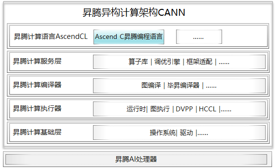

## 简介

+ ascend相关笔记

## ascend是什么

+ 2023年5月6日，在昇腾AI开发者峰会上，华为正式发布了面向算子开发场景的昇腾Ascend C编程语言。Ascend C原生支持C/C++编程规范，通过多层接口抽象、并行编程范式、孪生调试等技术，极大提高了算子的开发效率，帮助AI开发者低成本完成算子开发和模型调优部署。
+ 和CUDA开发的算子运行在GPU上一样，基于Ascend C开发的算子，可以通过异构计算架构CANN（Compute Architecture for Neural Networks）运行在昇腾AI处理器（可简称NPU）上。CANN是使能昇腾AI处理器的一个软件栈，通过软硬件协同优化，能够充分发挥昇腾AI处理器的强大算力。从下面的架构图可以清楚的看到，使用Ascend C编程语言开发的算子通过编译器编译和运行时调度，最终运行在昇腾AI处理器上。

+ 我们知道，通用计算就是我们常写的一些在CPU上运行的计算，它擅长逻辑控制和串行计算，而AI计算相对通用计算来说，更擅长并行计算，可支持大规模的计算密集型任务。
+ 最小计算代码能同时计算多个数据的乘加，更近一步，如果使用Cube计算单元，只需要一条语句就能完成一个矩阵乘的计算，这就是我们所说的SIMD（单指令多数据）。因此，我们通常使用AI处理器来进行大量的并行计算。
+ NPU不能独立运行，需要与CPU协同工作，可以看成是CPU的协处理器，CPU负责整个操作系统运行，管理各类资源并进行复杂的逻辑控制，而NPU主要负责并行计算任务。在基于CPU+NPU的异构计算架构中，NPU与CPU通过PCIe总线连接在一起来协同工作，CPU所在位置称为主机端（host），而NPU所在位置称为设备端（device）

## ascend C编程范式

+ Ascend C 编程范式是一种流水线式的编程范式，把算子核内的处理程序，分成多个流水任务，通过队列(Queue)完成任务间通信和同步，并通过统一的内存管理模块(Pipe)管理任务间通信内存。流水编程范式应用了流水线并行计算方法。